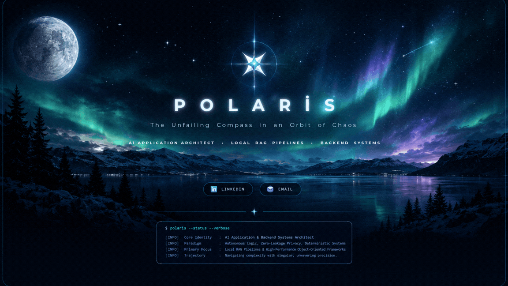

  <!-- POLARIS AESTHETIC BANNER -->
  

    

  <!-- ZARİF İLETİŞİM & AKADEMİK İKONLAR (BUZUL KUTUP MAVİSİ #7dd3fc) -->
  

    
    &nbsp;&nbsp;&nbsp;&nbsp;
    
    &nbsp;&nbsp;&nbsp;&nbsp;
    
    &nbsp;&nbsp;&nbsp;&nbsp;
    
    &nbsp;&nbsp;&nbsp;&nbsp;
    
    &nbsp;&nbsp;&nbsp;&nbsp;
    
  

 

### ✦ &nbsp; ABOUT ME&nbsp;
 

✦ &nbsp;   
> Third-year student building **high-performance** backend systems, **clean OOP structures**, and modern web applications (Java, Python, C, Next.js).

 

✦ &nbsp;   
> Approaching engineering challenges with creative perspectives; passionate about turning abstract, messy problems into functional, elegant, and impactful products.

 

✦ &nbsp;   
> Architecting privacy-first Local RAG systems, LLM workflows, and deterministic automations designed for **real-world reliability**.

 

✦ &nbsp;   
> Driven by intense curiosity, deep focus, and continuous exploration across technology, prose, and system design.

 

✦ &nbsp;   
> Ready to deliver end-to-end custom AI assistants, robust backend pipelines, and high-impact digital solutions.

   

## TECH STACK

 

  
  
  
  
  

  
  
  
  
  

   

## FEATURED PROJECTS

 

* ❄️ **[Kar Tanesi — Local RAG Assistant](https://github.com/medinesu/kar-tanesi-local-rag-assistant)** — Local RAG-based AI assistant built with Python & Streamlit.
* ☕ **[Java OOP Mini Projects](https://github.com/medinesu/Java-OOP-Mini-Projects)** — Core Object-Oriented Programming (OOP) principles and algorithmic logic.
* ⚙️ **[C Programming Homeworks](https://github.com/medinesu/C-Programming-Homeworks)** — Curated C programming assignments and algorithmic solutions.
* 🌐 **[Websitem](https://github.com/medinesu/websitem)** — Full-stack web development project powered by PHP & MySQL.

  

---

  <i>Polaris: The Unfailing Compass in an Orbit of Chaos</i>

